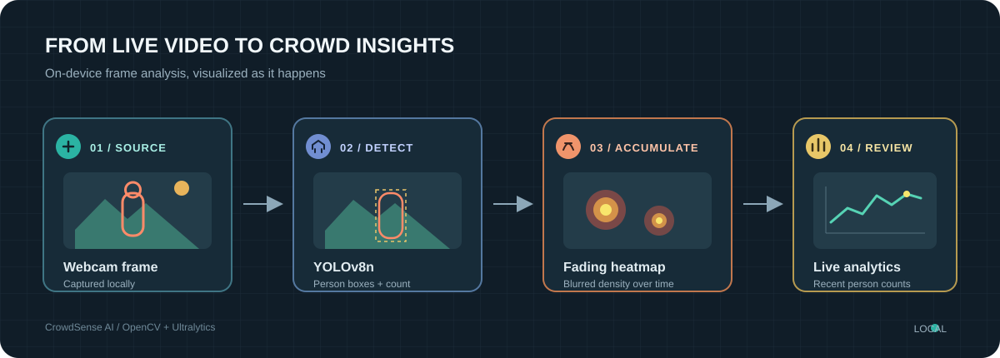

<div align="center">
  <h1>CrowdSense AI</h1>
  <p><strong>Real-time crowd monitoring with YOLOv8, a fading density heatmap, and live count analytics.</strong></p>
  <p>
    
    
    
    
  </p>
</div>

<p align="center">
  
</p>

## What It Does

CrowdSense processes a live camera feed on your computer. The primary app detects people in each frame, draws bounding boxes, accumulates detections into a fading heatmap, and plots recent counts in a live chart.

- **Person detection:** YOLOv8n detects the COCO `person` class and overlays a box on each detection.
- **Density view:** Detection centers feed a blurred heatmap that fades over time, making frequently occupied areas easy to spot.
- **Live count history:** A rolling chart shows recent per-second counts alongside the camera and heatmap.
- **Local processing:** The app does not record or upload camera frames.
- **Experimental model:** `Trained.py` is an optional research variant with a crowd threshold and custom weapon-model alerts. It requires `best.pt`; its detections are experimental and must not be used for safety-critical decisions.

## Quick Start

Use Python 3.12. A camera must be connected and available to OpenCV. The model weights are included in the repository.

```powershell
py -3.12 -m venv .venv
.\.venv\Scripts\Activate.ps1
python -m pip install --upgrade pip
python -m pip install -r requirements.txt
python main.py
```

On macOS or Linux, create and activate the environment with `python3.12 -m venv .venv` and `source .venv/bin/activate`, then run the same pip install and launch commands.

The first launch loads the bundled `yolov8n.pt` checkpoint and opens the default camera. Press **Q** or close the display window to exit. If the camera opens but cannot provide a frame, the app reports the startup failure and releases the camera.

## Applications

| Script | Purpose | Required weights |
| --- | --- | --- |
| `main.py` | Recommended webcam crowd monitor with person boxes, heatmap, and count chart | `yolov8n.pt` |
| `Trained.py` | Experimental crowd threshold and custom weapon-alert variant | `yolov8n.pt`, `best.pt` |

Run a script from the project directory so it can locate the model files. The experimental variant is separate from the recommended crowd-monitoring app; its alerts can be incorrect.

## Project Layout

```text
CrowdSense-Ai/
|-- assets/
|   `-- crowdsense-pipeline.svg
|-- best.pt
|-- main.py
|-- Trained.py
|-- requirements.txt
|-- yolov8n.pt
`-- README.md
```

`requirements.txt` lists the packages imported directly by the applications. PyTorch and the remaining Ultralytics runtime dependencies are installed transitively.

## Troubleshooting

- **Camera unavailable:** Check OS camera permissions and close other apps using the webcam. The primary app uses camera index `0`.
- **Missing model file:** Keep `yolov8n.pt` beside the script. `Trained.py` also needs the project-specific `best.pt` checkpoint.
- **Installation errors:** Confirm the active interpreter is Python 3.12 with `python --version`, activate `.venv`, then install from `requirements.txt` again.
- **Slow inference:** The included nano model is selected for a lighter workload. Performance depends on your CPU/GPU, frame size, and camera.

## Responsible Use

This is a computer-vision demonstration, not an identity-recognition system or a validated security product. Counts and heatmaps can be wrong when people overlap, are occluded, or appear at unusual angles. Do not use the experimental weapon alerts to make safety, enforcement, or emergency-response decisions. Follow local privacy and recording rules when operating a camera.

## License

No project license is included yet. Add a `LICENSE` file before granting permissions for others to reuse or redistribute this project. Ultralytics and model-weight terms may also apply; review their terms for your use case.